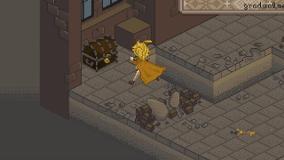

# Unnamed ARPG

This was my first earnest attempt at a "real" game. It was an action RPG, where the exploration and battles were done in a constinuous fashion. There were no transitions to battle and there was no turn order when fighting. This was to be a story heavy, story driven game.

## Cutscenes
For the story telling, I developed a "cutscene manager" to be able to direct cutscenes and merge them with the gameplay. It allowed for map title screens/introductions, in-scene conversation, character and camera manipulation and fade in/out. 
The system would use be split into chuncks that would play sequencially. This allowed for changes in a chunck not to require changing the whole cutscene. This approach was also allowed for more flexibility in changing conversation chuncks where the player was interacting with the game and the scene couldn't play until the player advanced the conversation.
<!--  -->
<video src="assets/arpg_prototype/cutscene_2.mp4" autoplay loop muted style="width:640px;"></video>

This system worked, but needed some work to be able to be used in a full game. As it was, each part of the cutscene had to be made from scratch, and althought all cutscenes will need manual direction, some aspects of it could be automated to be reused. 
One of the things that I would do differently today would be to check out what are the industry norms for these systems. I created this by developing what/how I thought it made sense, but these already exist and have been well thought out. I don't have to re-invent them and risk falling into known traps. It is fun to carve my own path, but very time consuming and risky.

## Gameplay
I decided to restrict movement to the 4 isometric directions of the tiles to reduce in half the amount of sprites I would have to create. This was important because, since I am not an artist and had to spend too much time creating the sprites and animations, this would substantially cut in half the amount of sprites needed (vs 8 directions to include up, down, left and right).
By double tapping in a direction, the player would be able to do quick sidestep/jump. This was used for platforming, to jump over small holes, and in combat, for quick repositioing. This movement drained stamina as to not be abused by the player.
<!--  -->
<video src="assets/arpg_prototype/dash_2.mp4" autoplay loop muted style="width:480px;"></video>

Locking the game to the NW, NE, SE and SW directions was probably my biggest oversight.
As an avid gamer and FFT lover, the movement felt relatively natural to me even if the WASD (or Up Left Down Right) keys don't directly map to isometric directions. However, testing the game with friends they stated having trouble commading the character. And these friends aren't my mom. They are gamers, just haven't been exposed to FFT/FFTA on a WASD/D-Pad.
Since this game is not a turn-based game like FFT, but an real-time action focused one, this problem was probably a project killer if not addressed.

The combat system was active and real-time. The player could move freely and so could the enemies. The player was able to use melee attacks on enemies as well as on breakable objects.
#### gif a partir objecto -> se existir em video. talvez em unity se conseguir tratar dos problemas deste build. Tentar encontrar build do jogo

The player had access to magic that could be used as long as the player had the necessary mana for the respective spell.
The regain mana, the player could stop and focus for some seconds.

#### gif a ganhar mana

## Battle UI

In regards to the UI, the player portrait was shown in the top left corner of the map, along with Health, Mana and Stamina.

#### imagem do portrait

For the enemies, a dynamic UI was created. It appeared when they showed up in the map and disappeared after beign defeated. In case of bosses, they had a unique look, but functioned more of less the same (they were prioritized/always on top).

#### gif do UI de inimigos/bosses a aparecer

For the spells, the player could rotate between the available spells. These would be seen in the spells UI at the bottom right of the screen.

#### gif do seleção de spells

A similar system was used for item management during battles.

#### gif dos items

## Exploration UI

The game used a pop-up icon above the player head, akin to FF9 (yes, yes, I love FF, leave me alone!), when actions were available to the player (talking to an NPC, investigating an object, opening a teasure chest).

<!-- [Opening a treasure chest](assets/arpg_prototype/opening_chest_20fps_320p.gif) -->
#### meter gif a mostrar vários icons de ação

For in-game tutorial or notifications, a notification system was developed to show special information on the top-right corner of the screen

#### gif com exemplo da cena do tutorial

#### explicar o tutorial?

For the conversations, I developed a 4 conversation bubble sizes. The logic on which size to use was done by YYYYYYY.
For translations, the idea was to ZZZZZZ.
The arrow was dynamic and showed up from the source of the conversation.
There were HHHHHH types of bubbles for A, B and C.

#### gif showing Conversation UI

For the chest UI, a special bubble would show up bottom-centered stating what the player obtained.

There was also logic for storing the items in the inventory, but inventory management UI was not yet created, other then for the ones that were to be used in battle that showed up on the bottom left corner of the screen.

## Final thoughts
This was just the prototype for the base gameplay loop, with some ideas I had. If continued, the final product would probalby look very different as ideas were to be refined. I underestimated the task of overestimated my habilities to be able to make a game in a reasonable amount of time. I have great respect for those who were able to follow this route, but as this and PTGP prooved, it is just too big a task for me alone.

