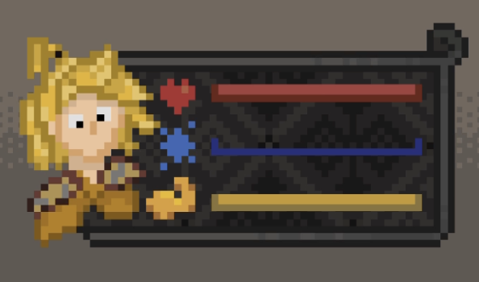
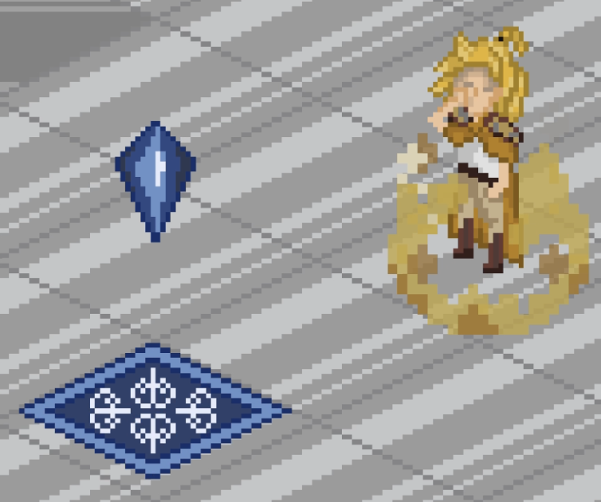
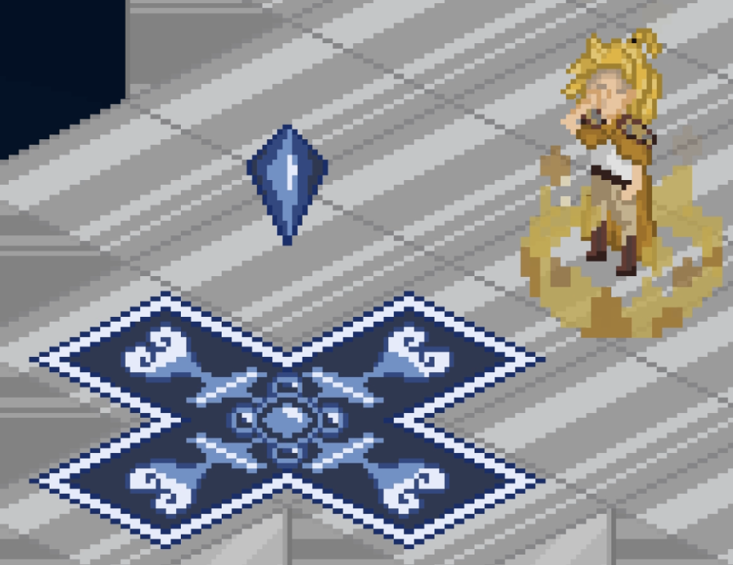

# Unnamed ARPG

This was my first earnest attempt at a "real" game. It was story driven pixel art RPG adventure, where the exploration and battles were done seamlessly, without battle transitions or turn orders during combat.

## Cutscenes
For the story telling, I developed a "cutscene manager" to be able to direct cutscenes and merge them with the gameplay. It allowed for map title screens/introductions, in-scene conversation, character and camera manipulation and fade in/out. 
The system would use be split into chuncks that would play sequencially. This allowed for changes in a chunck not to require changing the whole cutscene. This approach was also allowed for more flexibility in changing conversation chuncks where the player was interacting with the game and the scene couldn't play until the player advanced the conversation. 

<video src="assets/arpg_prototype/cutscene_2.mp4" autoplay loop muted style="width:640px;"></video> 

This system worked, but needed some work to be able to be used in a full game. As it was, each part of the cutscene had to be made from scratch, and althought all cutscenes will need manual direction, some aspects of it could be automated to be reused. 
One of the things that I would do differently today would be to check out what are the industry norms for these systems. I created this by developing what/how I thought it made sense, but these already exist and have been well thought out. I don't have to re-invent them and risk falling into known traps. It is fun to carve my own path, but very time consuming and risky.

## Gameplay
I decided to restrict movement to the 4 isometric directions of the tiles to reduce in half the amount of sprites I would have to create. This was important because, since I am not an artist and had to spend too much time creating the sprites and animations, this would substantially cut in half the amount of sprites needed (vs 8 directions to include up, down, left and right).
By double tapping in a direction, the player would be able to do quick sidestep/jump. This was used for platforming, to jump over small holes, and in combat, for quick repositioing. This movement drained stamina as to not be abused by the player. 

<video src="assets/arpg_prototype/dash_extended.mp4" autoplay loop muted style="width:480px;"></video> 

Locking the game to the NW, NE, SE and SW directions was probably my biggest oversight. As an avid gamer and FFT lover, the movement felt relatively natural to me even if the WASD (or Up Left Down Right) keys don't directly map to isometric directions. However, testing the game with friends they stated having trouble commading the character. And these friends aren't my mom. They are gamers, just haven't been exposed to FFT/FFTA on a WASD/D-Pad. Since this game is not a turn-based game like FFT, but an real-time action focused one, this problem was probably a project killer if not addressed. 

The combat system was active and real-time. The player could move freely and so could the enemies. Outside of battle, the player was able to use melee attacks on breakable objects. 

<video src="assets/arpg_prototype/breaking_object.mp4" autoplay loop muted style="width:480px;"></video> 

The player had access to magic that could be used as long as the player had the necessary mana for the respective spell. The regain mana, the player could stop and focus for some seconds. 

<video src="assets/arpg_prototype/recover_mana.mp4" autoplay loop muted style="width:540px;"></video> 

## Battle UI
In regards to the UI, the player portrait was shown in the top left corner of the map, along with health, mana and stamina.  

 

For the enemies, a dynamic UI was created. It appeared when they showed up in the map and disappeared after beign defeated. The enemy UI appeared on the top-right corner, opposing the player's UI.  In case of bosses, they had a unique look, but functioned more or less the same (although they were prioritized/always on top). 

 

For the spell selection, the player could rotate between the available spells. These would be seen in the spells UI at the bottom right of the screen. 

<video src="assets/arpg_prototype/ui_spells.mp4" autoplay loop muted style="width:320px;"></video> 

When the player pressed the magic button, time would stop (enemies, etc would stop moving) and the UI would appear to confirm how the spell would be used. For each of the four spells, there was an acompayining UI element. 
For the fire spell, the player had to select the direction. 

<video src="assets/arpg_prototype/spell_fire_anim.mp4" autoplay loop muted style="width:320px;"></video> 

For the remaining spells, the player would select where they should be used and their area of effect would be shown as a priview. 

   

For items usage during battle, the UI in the bottom-left showed which item was selected. 

 

The items were usable to regain health and mana, but no animations for usage had yet been developed.

## Exploration UI

The game used a pop-up icon above the player head, akin to FF9 (yes, yes, I love FF, leave me alone!), when actions were available to the player (talking to an NPC, investigating an object, opening a teasure chest). 

<video src="assets/arpg_prototype/actions.mp4" autoplay loop muted style="width:480px;"></video> 

For in-game tutorial or notifications, a notification system was developed to show special information on the top-right corner of the screen. 

<video src="assets/arpg_prototype/ui_tutorial_attack.mp4" autoplay loop muted style="width:320px;"></video> 

The tutorial would show how the player how to move, use the action button and provide guidance on the mechanics of the combat system. 

For the conversations, I developed 4 conversation bubble sizes. The logic on which size to use was done depending on the size of the current text message. For now it was done manually, but the idea was to make a function to determine the size necessary chat bubble for the text messagem. Since the pixel art font I created did not monospace, the function would have to add the sizes occupied by each character individually. 

<video src="assets/arpg_prototype/ui_chat.mp4" autoplay loop muted style="width:480px;"></video> 

The ballon source indicator was dynamic and showed up from the talker. 
 
There were 4 types of bubbles: 
- Conversation bubbles 
- Obtaining items 
- Action information (e.g.: "The door has been unlocked") 
- Notifications/tutorial messages 

Regarding multiple languages/translations, at this point the game was all being developed in portuguese only, but the idea was to do something simular to what I used in Portual Tourism GP (you can check the logic out in its in-depth page) to at-least have the game also in English. 

For the chest UI, the special bubble would show up bottom-centered showing what the player had obtained. 

<video src="assets/arpg_prototype/chest.mp4" autoplay loop muted style="width:480px;"></video> 

I developed the logic for storing the items in the inventory, but did not get to the inventory management UI, other then for the ones that were to be used in battle that showed up on the bottom left corner of the screen.

## Final thoughts
This was just the prototype for the base gameplay loop, with some ideas I had. If continued, the final product would probalby look very different as ideas were refined. I underestimated the task of overestimated my habilities to be able to make a game in a reasonable amount of time. I have great respect for those who were able to follow this route, but as this and PTGP prooved, it is just too big a task for me alone.

